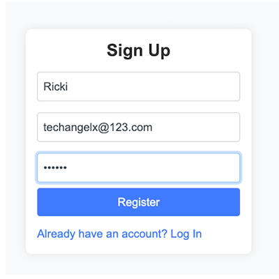
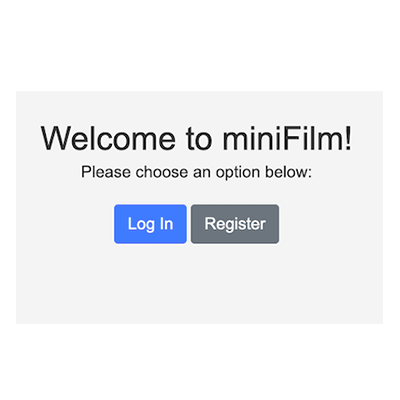
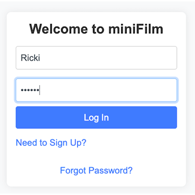

# miniFilm

### :sparkles: VERSION 2.0:sparkles:
**Adds a simple front-end login or registration page (for those who don't wanna use Postman)**

<div style="display: flex; justify-content: center; gap: 10px;">



</div>

**miniFilm** is a test application for managing users and a film library, serving as foundational building blocks for any user registration, login, and OAuth 2.0 API setup. Built with **Node.js**, **Express**, **MongoDB**, and **JWT**, this app provides secure user authentication and full CRUD functionality.
## Features

- **User Management**: Secure registration, login, and JWT-based authentication for users.
- **Film Library**: Create, read, update, and delete films, ideal for managing a collection.
- **Password Hashing**: User passwords are securely hashed using bcrypt.
- **Input Validation**: Ensures data integrity using Node Joi for both user and film data.
- **OAuth 2.0 Ready**: Lays the groundwork for implementing OAuth 2.0 authentication.
- **Protected API Routes**: Film data access is secured via JWT verification.
- **Postman Testing**: Front-Endless design. Quickly test routes and verification features using Postman.
- **Protected API Routes**: Film data access is secured via JWT verification.
- **New Feature**: Now features a simple login and registration page, independent of the auth/Postman setup.

// TODO: Implement client-side basic form validation

This project is a practical guide to developing RESTful APIs with user authentication, validation, and basic OAuth 2.0 compatibility.
# Environment Variables Setup
To ensure the security of sensitive information, make sure you encapsulate your environment credentials in a `.env` file. This includes important values like the database connection string, JWT token secrets, and the server port.

### Example `.env` file

```plaintext
DB_CONNECTOR=mongodb+srv://<username>:<password>@cluster.mongodb.net/miniFilms?retryWrites=true&w=majority
TOKEN_SECRET=yourSecretToken
PORT=3000
```
Don't forger to add `.env` to `.gitignore` to keep sensitive information secure and out of version control.
## Acknowledgment
Special thanks to  Dr. Stelios Sotiriadis  
Lecturer, Department of Computing and Mathematical Sciences  
Bikbeck, University of London

## License

This project is licensed under the ISC License. Feel free to use it as needed, and do drop me a line to know your thoughts.

